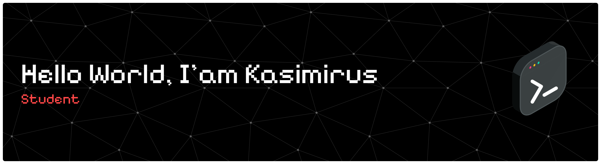

###

 

  

###

<h2 align="left">Code</h2>

###

  
  
  
  
  
  
  
  
  
  
  
  
  
  
  
  
  

###

<h2 align="left">Social Media</h2>

###

   
  
  
  

###

<h2 align="left"></h2>

###

  

###

<picture>
  <source media="(prefers-color-scheme: dark)" srcset="https://raw.githubusercontent.com/kkasim/kkasim/output/pacman-contribution-graph-dark.svg">
  <source media="(prefers-color-scheme: light)" srcset="https://raw.githubusercontent.com/kkasim/kkasim/output/pacman-contribution-graph.svg">
  
</picture>

###
